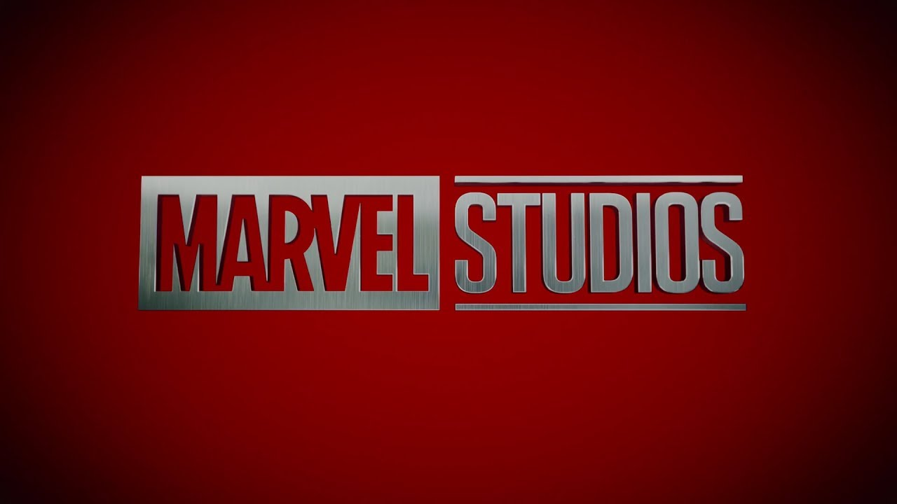
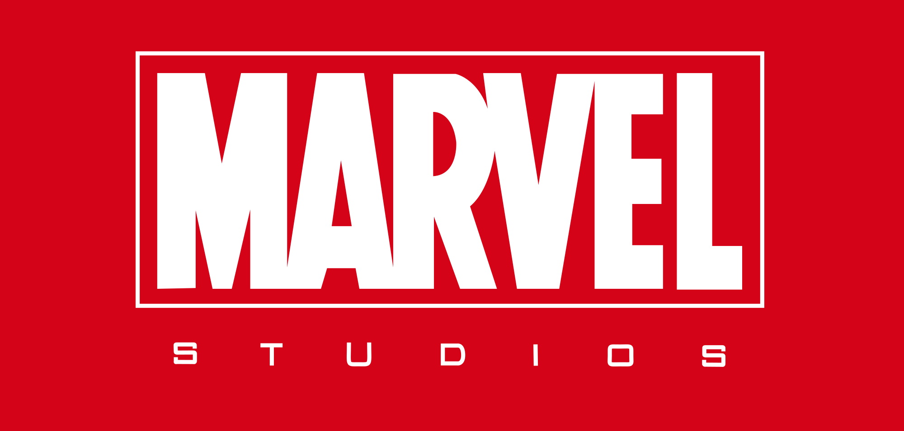

can you improve grammar and tone of the following text

In the last Dr. Strange Trailer, Marvel revealed to the wide public their new Logo. While a lot of design effort was put into the new logo something was just not feeling write It took me a long time to figure out what was really bothering me about the logo.

## Old Logo

First lets compare the two logos directly. In the old Marvel Logo there was a visual emphasis on the "Marvel" and the "studio" was visually not relevant, almost not visible. This caused the viewer to only associate the word "Marvel" with the product. When people would talk about the Movies they would say "did you see the latest **Marvel** movie", nobody would say did you see the latest **Marvel Studios** movie?"

However in the new logo both elements have the same visual weight. Telling the viewer this movie is made by **Marvel Studios** instead of **Marvel.**

# Marvel Cinematic Universe

The old logo also tied the Marvel Cinematic Universe together. It was a consistent element that was only shown before a MCU Movie. Movies that are produced by other companies like the "X-Men"-franchise have a flat simple Marvel Logo without any "studio" in the title.

Now it is much easier to identify a MCU Movie vs other franchises.

# Time of the reveal

The logo was officially revealed at Comic Con. However the broad public does not go to comic con or reads up on what is actually happening in comic con. Most of the people will have seen the logo for the first time with the Dr. Strange Trailer.

I think that is a quite odd choice to reveal the logo. Most people have not heard of Dr Strange, he has not been introduced to the MCU Movies. By changing the Logo it is unclear for viewers if it is now a MCU Movie or if now Marvel has started another new thing.

For Dr. Strange, it seems like a totally different studio is doing the movie, the visuals are strange, a lot of visual tricks, etc. It looks a little like Inception? It differs already a lot from the other movies previously produced by **Marvel Studios**.

For me I think the usage of the new logo would have been best with an already well known character like the next upcoming Thor 3 Movie. (I would not have revealed it before the Avengers 3 movie, since you would want to bank on an already established brand)

# Different Message of the Fanfare

https://www.youtube.com/watch?v=FpE9QkKc1OU

The old fanfare had one single simple message: We are marvel, we make a comics.

There was nothing specific, it is open ended, with a simple message. Anything can happen.

https://www.youtube.com/watch?v=ZKxxmxU8GNo

The new fanfare, is a story, look at these amazing comic images of superheroes, look we assembled them into a team, now they are real people, look at these awesome movies we created in the past. And the music drives it home as, we are the most epic guys around.

Now it must be an epic movie. It cannot be a cute little story with little at stake, it must be epic. Which is kind of sad, since there are a lot of possibilities for smaller stories... but we will probably not see them for a while.

# Conclusion

Overall, it is going to take some time to get used to the new logo. However I do understand that they needed to change the Logo, simply not to be confused with the X-Men, Fantastic 4, and (older) Spiderman Movies.
